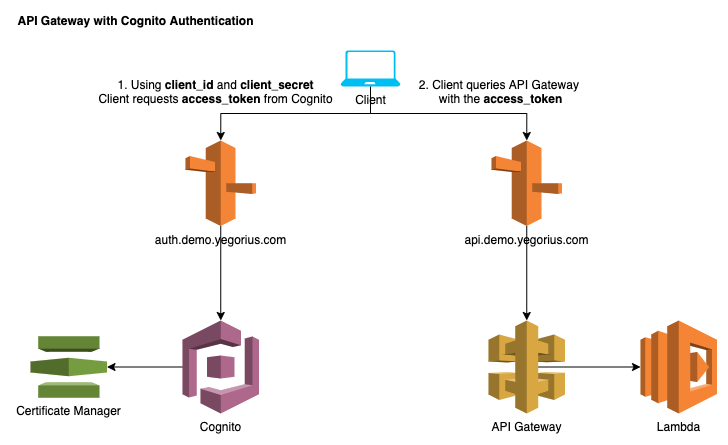

# API Gateway with Cognito Authentication Terraform Module

Terraform module to create an AWS API Gateway with Cognito authentication.

## Overview



The module creates the following AWS resources.

1. ACM Certificate
   1. Wildcard certificate for specified domain, e.g. `*.demo.yegorius.com`.
   1. Created using [AWS Certificate Manager (ACM) Terraform module][].
1. API Gateway
   1. API with Lambda integration.
   1. Custom domain name for the API.
      1. This creates a CloudFront distribution with the wildcard certificate referenced above.
      1. The custom domain name is `api.demo.yegorius.com`. This is the actual endpoint of the API.
   1. An API endpoint created to test the end-to-end setup.
      1. GET on <https://api.demo.yegorius.com/v1/hello_world>
1. Lambda
   1. A function that API Gateway endpoint points to.
1. Cognito
   1. Cognito User Pool.
      1. Only an App Client is created. This means that this Cognito setup is only able to perform `client_credentials` authentication flow.
      1. This type of flow is used for granting an application access to the API Gateway API or for server-to-server communication.
      1. Requests to the API Gateway must contain a valid `access_token`.
      1. The only reason we need the Cognito User Pool is to host the App Client. There are no actual users or groups involved.
   1. App Client.
      1. This is where the `client_id` and `client_secret` are hosted, which are essentially equivalent to a username / password pair, which need to be specified when asking Cognito for an `access_token`.
   1. Cognito Custom Domain.
      1. A user-friendly Cognito DNS name which clients query in order to obtain `access_token`, e.g. <https://auth.demo.yegorius.com>.
   1. Resource Server.
      1. The URL that points to the resource that needs to be authenticated, e.g. <https://api.demo.yegorius.com>. In order to perform API calls to this API, the client needs the `acess_token` from Cognito.
1. Route53
   1. DNS Zone, e.g. `demo.yegorius.com`
      1. This zone manages DNS records inside the domain name.
      1. In my case, I have `yegorius.com` registered on GoDaddy. There, I created NS records to point to this DNS zone in AWS.
   1. `api.demo.yegorius.com` `A` record alias pointing to API Gateway's CloudFront distribution.
   1. `auth.demo.yegorius.com` `A` record alias pointing to Cognito's CloudFront distribution.

## Usage

Replace `aws_account_id`, `domain_name`, and other variables are desired.

```terraform
module "api_gateway_cognito" {
  source = "git::https://github.com/yegorski/terraform-aws-api-gateway-cognito.git?ref=master"

  aws_account_id = "YOUR_AWS_ACCOUNT_ID"
  domain_name    = "demo.yegorius.com"  # Zone name, with DNS delegation from your DNS provider
  name           = "api"
  region         = "us-east-1"

  tags = {
    Owner       = "yegorski"
    Environment = "production"
  }
}
```

## Testing

After applying this module, check that the API is up and is indeed behind authentication.

- Verify that the API cannot be reached without an access token.

```bash
curl -X GET \
  https://api.demo.yegorius.com/v1/hello_world \
  -H 'Content-Type: application/json' \
  && echo ""
```

Response:

`{"message":"Unauthorized"}`

- Verify Cognito grants a valid access token.

```bash
curl -X POST \
  'https://auth.demo.yegorius.com/oauth2/token?grant_type=client_credentials' \
  -H 'Authorization: Basic base64(client_id:client_secret)' \
  -H 'Content-Type: application/x-www-form-urlencoded' \
  && echo ""
```

Response:

```json
{
  "access_token": "<token>",
  "expires_in": 3600,
  "token_type": "Bearer"
}
```

- Verify that the API can be reached with a valid access token.

```bash
curl -X GET \
  https://api.demo.yegorius.com/v1/hello_world \
  -H 'Authorization: Bearer <token>' \
  -H 'Content-Type: application/json' \
  && echo ""
```

Response:

`"Hello World!"`

[aws certificate manager (acm) terraform module]: https://github.com/terraform-aws-modules/terraform-aws-acm
[cognito aws service]: https://console.aws.amazon.com/cognito/home?region=us-east-1
[route53 aws service]: https://console.aws.amazon.com/route53/home?region=us-east-1
